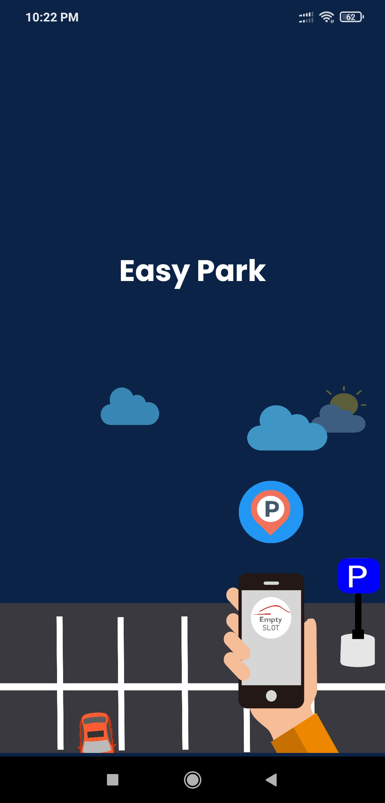
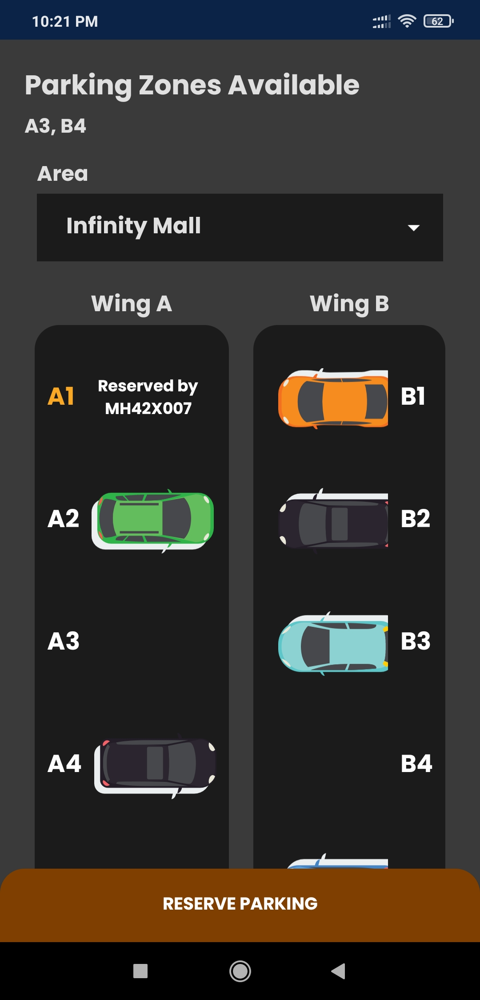
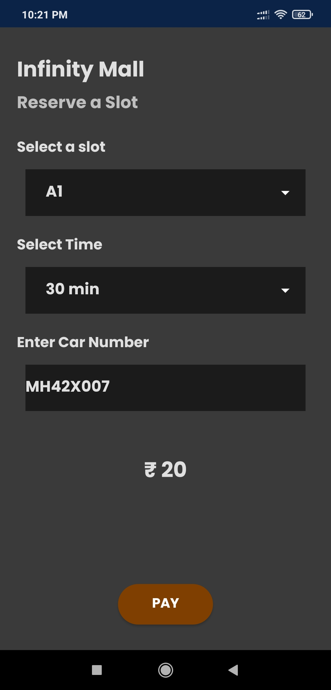
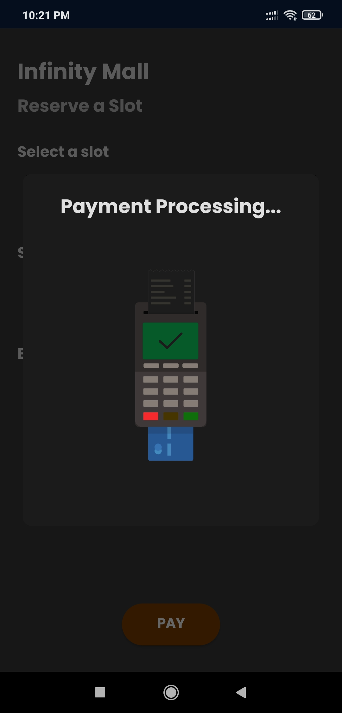

# [EasyPark](https://github.com/CatalystMonish/EasyPark)
## Hassel-free Parking Solution &middot;

  

   

:loudspeaker: This app was created as an solution to a problem presented in Eureka!

**DESCRIPTION**

## About App
With the growing number of cars on the road, it has become time-consuming to look for a parking spot at all places. All parking lots are filled with cars and one has to take several rounds of the parking lot to find a place to park their car. 

To resolve this problem of the car drivers,  “EasyPark” mobile application has been developed. EasyPark is an IOT based application that helps by providing the users’ vacant spots that can be used to park their vehicles.

The idea behind our Android Application-“EasyPark” is to help the user analyze areas where parking is available and the number of slots free in that area.


## Features

```
> Personalized experience
> Easy-to-use GUI
> Online Database
> Live tracking of parking 
> Fast service 
```

### Developed and Maintained By:
* [Alt Half Life](https://github.com/CatalystMonish)
